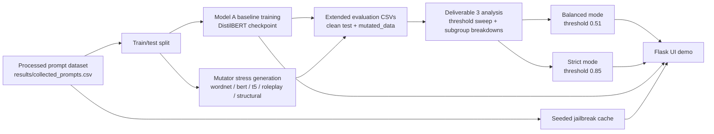

# Deliverable 3 Architecture

## Notes

- The Deliverable 3 production recommendation is the calibrated `Model A` checkpoint.
- The adversarial/cache-backed branch remains in the repo as a research artifact and comparison point.
- Interface and report evidence:
  - [Refined UI](/Users/mrunal/Documents/Projects/ADL/Jailbreak Detection/ui/app.py)
  - [Extended report PDF](/Users/mrunal/Documents/Projects/ADL/Jailbreak Detection/reports/deliverable3_report.pdf)
  - [Deliverable 3 summary JSON](/Users/mrunal/Documents/Projects/ADL/Jailbreak Detection/results/deliverable3/deliverable3_summary.json)
